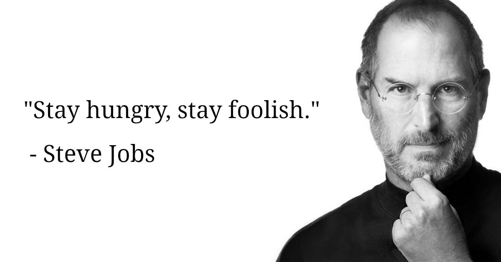

   <h1>Hi there, I'm <a href="https://www.linkedin.com/in/reinaldomml/">Reinaldo</a>  </h1>

   <!-- &nbsp;&nbsp;
&nbsp;&nbsp; -->

 

<h3>💻 University student in IT | 🇧🇷 Brazilian living in 🇳🇱 The Netherlands</h3>

   
      
    
   <!--  -->
 

I'm 31 years old University student in a career transition to IT from Leiden City in The Netherlands. Right now, I'm Studying for a degree in Systems Analysis and Development.

-   🌱 Learning Javascript + Express + Node, Tailwind CSS, PostgreSQL, Puppeteer.

-   ✏️ I write a Blog in https://medium.com/@reinaldomml

-   I love Solopreneurship, Star Wars, E-Sports.

-   I believe that technology is like magic 💫

<b>Background:</b> I worked as a Digital marketing specialist with more than +10 years of experience in strategies for companies using Google Ads, Facebook Ads, WordPress, Power BI, GTM, SEO, and Inbound Marketing.

  <!--  -->
  

 

<h2 align="center"> ⚙️ Languages and Tools</h2>

  <!-- For more icons please follow  https://github.com/MikeCodesDotNET/ColoredBadges -->
  
  
  
  
  
  
  
  
  
  
  
  

<h2 align="center"> 🚀 Main Repositories</h2>

 

<h2 align="center">🤝 Support</h2>

🎁 Contributions, 🔥 issues, and 🍪 feature requests are most welcome!

💙 If you like my projects, Give them ⭐ and <u>Share it with friends!</u>

Made with ❤️ in The Netherlands

<h1 align='center' style="vertical-align:top; margin:1rem;">⚡️ Stay foolish! ⚡️</h1>

---

### 🤝 Credits & Acknowledgments to:

Team from [markdown-badges](https://github.com/Ileriayo/markdown-badges), [GitHub Readme Stats](https://github.com/anuraghazra/github-readme-stats) and profile from @mayhemantt in [mayhemantt](https://github.com/mayhemantt/mayhemantt).
