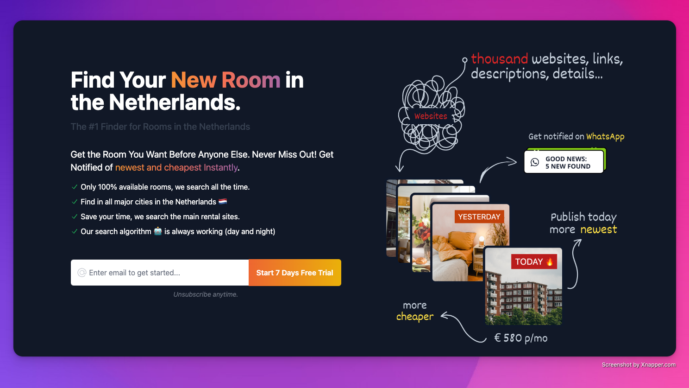

   <h1>Hi there, I'm <a href="https://www.linkedin.com/in/reinaldomml/">Reinaldo</a>  </h1>

<h3>💻 Product Owner & Node.js Developer | 🇧🇷 Brazilian living in Santa Catarina, Brazil</h3>

   
   
 

I'm 34 years old and currently working as Product Owner and Node.js Developer at HH Finance and Investfy. I focus on leading digital launches and developing SaaS products in the financial education sector, acting as a Node.js and React specialist programmer, as well as Product Owner.

My goal is to develop innovative solutions that meet the needs of learners and investors, ensuring rich and interactive interfaces through advanced use of React and TypeScript.

- 🌱 Learning now - PostgreSQL + React + Next.js + Supabase

- 🤖 Currently studying - Agno AI

- I love Indie Maker Culture, Star Wars, E-Sports.

- I believe that technology is like magic 💫

<b>Career Background:</b> Currently working as Product Owner and Node.js Developer, focused on developing SaaS solutions for financial education. I lead digital marketing campaigns with advanced tracking, using custom conversions with Pixel and Google Tag Manager, integrated on AWS platforms. My technical expertise extends to React and TypeScript for developing intuitive front-ends, while using Node.js to structure robust back-ends.

 

<h2 align="center"> ⚙️ Languages and Tools</h2>

  <!-- For more icons please follow  https://github.com/MikeCodesDotNET/ColoredBadges -->
  
  
  
  
  
  
  
  
  
  
  
  
  
  
  
  
  
  
  
  

 

<h2 align="center">🚀 Latest Project</h2>

  
    

<b>🚀 Latest Project:</b> Roomfi at <https://roomfi.me> - designed to assist students in the Netherlands in navigating the rental market. It collects data from 3 leading rental websites using Puppeteer/Crawlee. Additionally, it categorizes rooms and sends the information to respective WhatsApp groups. Built with Node.js, Express, and Whatsapp-web.js, with a frontend designed using Tailwind CSS, it is hosted on a Digital Ocean Ubuntu Server with PM2 and Nginx. Your visit and feedback are greatly appreciated!

  
  

 

<h2 align="center">🤝 Support</h2>

🎁 Contributions, 🔥 issues, and 🍪 feature requests are most welcome!

💙 If you like my projects, Give them ⭐ and <u>Share it with friends!</u>

Made with ❤️ in Brazil

<h1 align='center' style="vertical-align:top; margin:1rem;">⚡️ Stay foolish! ⚡️</h1>

---

### 🤝 Credits & Acknowledgments to

Team from [markdown-badges](https://github.com/Ileriayo/markdown-badges), [GitHub Readme Stats](https://github.com/anuraghazra/github-readme-stats) and profile from @mayhemantt in [mayhemantt](https://github.com/mayhemantt/mayhemantt).
